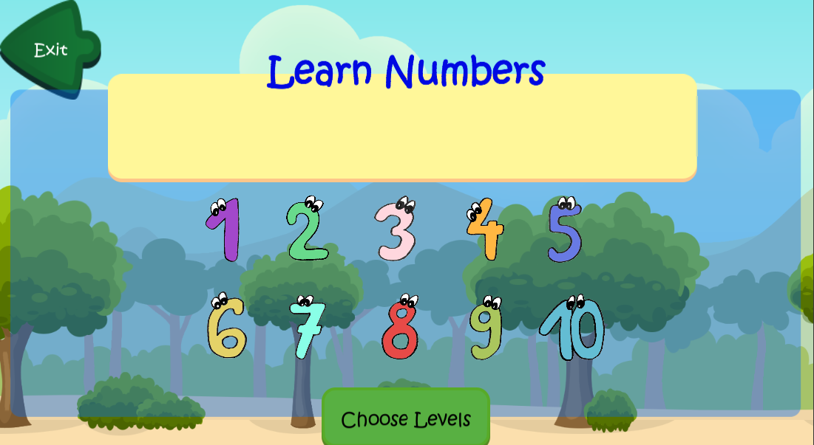
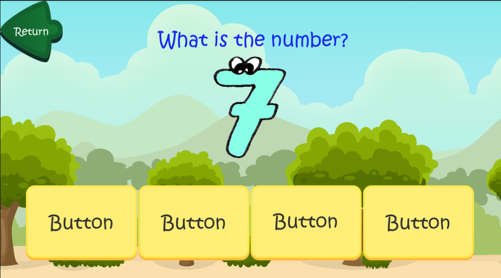
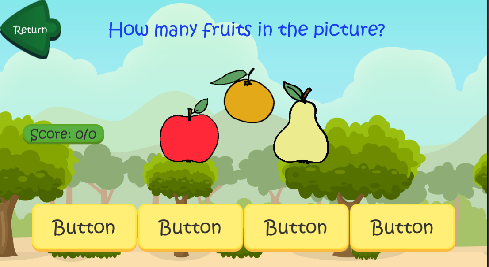
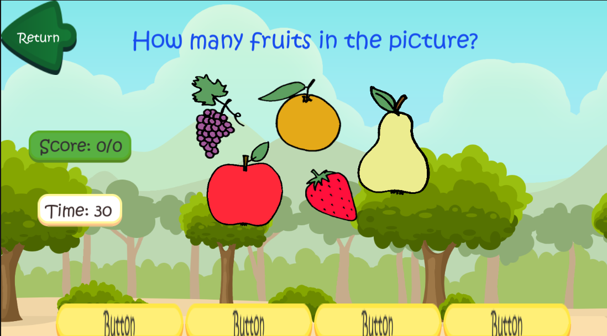

# Numbers Quiz Game 🎮

An educational quiz game designed for children to learn **numbers and counting in English** in a fun and interactive way.

---

## 📌 Project Overview

**Numbers Quiz Game** is a mini educational game developed using **Unity** and **C#**.  
The game focuses on helping children improve their numerical skills through visual questions, interaction, and audio feedback.

This project was created as part of a **university project**, and it was **developed and implemented by Ahmed Hamed**.

---

## 🎯 Game Objective

The main goal of the game is to:
- Teach children numbers in English
- Improve counting skills
- Support children who cannot read fluently through audio assistance
- Make learning engaging using game mechanics

---

## 🧩 Game Features

- Learning module for understanding numbers
- 3 different quiz levels with increasing difficulty
- Voice assistance that reads answers aloud when hovering over buttons
- Visual-based questions suitable for children
- Simple and child-friendly user interface

---

## 🕹️ Game Levels

### 🔹 Level 1: Number Recognition
- An image of a number is shown as the question.
- The player can try multiple times until the correct answer is selected.
- Designed for beginners to recognize numbers easily.

---

### 🔹 Level 2: Counting Fruits
- The player must count the number of fruits shown on the screen.
- Only **one attempt** is allowed per question.
- Encourages focus and accuracy.

---

### 🔹 Level 3: Timed Challenge
- A **30-second timed quiz**.
- The timer changes color depending on the remaining time.
- The goal is to answer as many questions correctly as possible before time runs out.
- Tests speed and counting skills under pressure.

---

## 📸 Game Screenshots

### Learning Module

### Choosing a Level

### Quiz Level 1

### Quiz Level 2

### Quiz Level 3

---

## 🔊 Accessibility Feature

For children who cannot read fluently:
- The game includes a **voice feature**
- When the mouse hovers over an answer button, the content is read aloud
- This makes the game more inclusive and easier to use

---

## 🛠️ Technologies Used

- Unity Engine
- C# Programming Language
- Unity UI System
- Audio System for voice feedback

---

## 👨‍💻 Developer

**Ahmed Hamed**  
University Project – Educational Game Development

---

## 📚 Project Type

Educational Mini Game  
Developed for academic purposes and learning enhancement for children.

